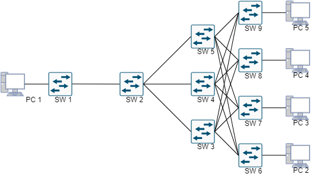

# Sterownik w zastosowaniu jako firewall na atak typu TCP SYN FLOOD - Projekt zaliczeniowy na przedmiot "Sieci Sterowane Programowo"

## Środowisko

### Sterownik - Floodlight

Do przygotowania środowiska dla sterownika posłużono się maszyną wirtualną przygotowaną na potrzeby laboratorium.

Kroki przygotowawcze:

1. Pobierz i zainstaluj wybrane narzędzie hypervisora (np. [Virtualbox](https://www.virtualbox.org/) lub [Vmware Player](https://www.vmware.com/products/workstation-player.html))
2. [Pobierz](#foo) i zainstaluj maszynę jako dysk maszyny wirtualnej w oprogramowaniu hypervisora
3. Zmień tryb karty sieciowej maszyny na "Bridged"
4. Uruchom maszynę wirtualną

### Emulator Sieci - Containernet

Jako emulator sieci posłuży fork popularnego Minineta, który umożliwia łatwiejsze tworzenie skryptów topologii oraz umożliwia użycie kontenerów jako hostów w sieci, ich dynamiczne dodawanie, możliwość uruchomienia środowiska w kontenerze, a także automatyczną instalację, kontrolę ruchu na łączach.

Kroki przygotowawcze - Instalacja bare metal:

1. Zainstaluj dystrybucję linuxa - Ubuntu (potzebne jest wsparcie dla generatora ruchu). Zalecana wersja przez twórców Containernet to [LTS 20.04](https://releases.ubuntu.com/focal/). Dowolny wybór wersji - Desktop/Server. Najpewniej istnieje możliwość użycia [WSL](https://learn.microsoft.com/en-us/windows/wsl/about), natomiast zalecane jest wykorzystanie oddzielnej maszyny wirtualnej
2. `sudo apt update`
3. `sudo apt-get install git-all -y`
4. `sudo apt-get install ansible -y`
5. `git clone https://github.com/containernet/containernet.git`
6. `sudo ansible-playbook -i "localhost," -c local containernet/ansible/install.yml`

Uruchomienie topologii sieciowej:
`sudo python3 examples/nazwa_pliku_topologii.py`

### Generator Ruchu - Packit

Do symulowania ataku DoS w sieci został użyty generator ruchu Packit, dzięki któremu można dowolnie modyfikować wysyłane pakiety - personalizować adresy, protokoły, porty, flagi itd.

Instalacja:

1. Na maszynie, na której jest zainstalowany Containernet doinstaluj generator
2. `sudo apt install packit -y`

Przykład użycia:
`sudo packit -t TCP -d 10.0.0.1 -c 100 -w 0` - wyślij 100 pakietów na adres 10.0.0.1 jak najszybciej i użyj do tego protokołu warstwy czwartej TCP.

W przypadku, gdy chcemy użyć konkretnego hosta, wystarczy się na niego zalogować `xterm <nazwa_hosta>` i wykonanać na nim konkretny skrypt

## Topologia

## Literatura

📗 [D. Kim, P. T. Dinh, S. Noh, J. Yi and M. Park, "An Effective Defense Against SYN Flooding Attack in SDN," 2019 International Conference on Information and Communication Technology Convergence (ICTC), Jeju, Korea (South), 2019](https://ieeexplore.ieee.org/document/8939937)
📗 [SAFETY: Early Detection and Mitigation of TCP SYN Flood Utilizing Entropy in SDN," in IEEE Transactions on Network and Service Management, vol. 15, no. 4, pp. 1545-1559, Dec. 2018](https://ieeexplore.ieee.org/document/8423699)
📕 [Packit](https://linux.die.net/man/8/packit)
📕 [Containernet](https://containernet.github.io/)
📕 [M. Peuster, H. Karl, and S. v. Rossem: MeDICINE: Rapid Prototyping of Production-Ready Network Services in Multi-PoP Environments. IEEE Conference on Network Function Virtualization and Software Defined Networks (NFV-SDN), Palo Alto, CA, USA, pp. 148-153. doi: 10.1109/NFV-SDN.2016.7919490. (2016)](https://ieeexplore.ieee.org/document/7919490)
